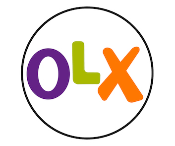
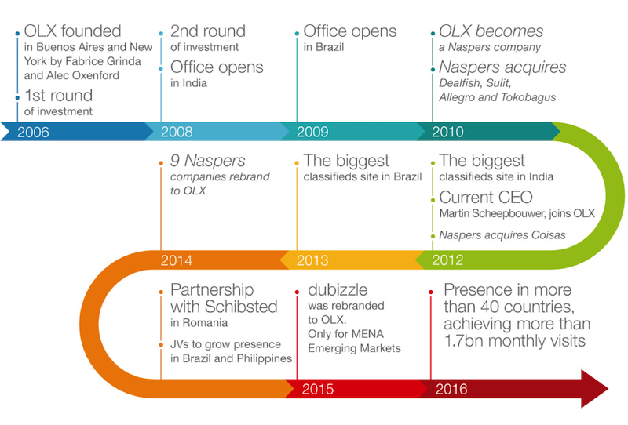
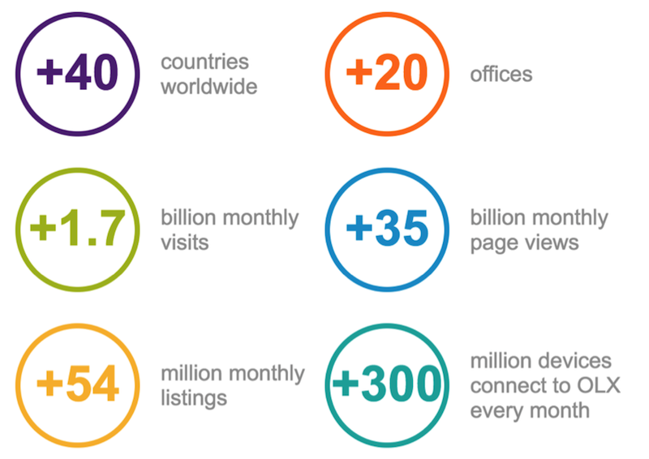

class: center, middle

# Container Experiences 

#### Hard Lessons learnt

 

.left[
David Rubin]
.left[
[<i class="fa fa-twitter" aria-hidden="true"> drubin87</i>](http://twitter.com/drubin87)]
.left[
[<i class="fa fa-github" aria-hidden="true"> drubin</i>](http://github.com/drubin)]
.left[
[<i class="fa fa-linkedin" aria-hidden="true"> David Rubin</i>](https://www.linkedin.com/in/davidrub)]

---

# Me 
 

---

# History 
 

---

# Stats 

---

# Beginning 

---
class: center, middle

# Why 

##Increasing confidence, predictability and consistency

---
# The “able”s

* Composable
* Predictable 
* Reproducible
* Versionable 
* Auditable
---

# Compromises 

---
class: center, middle

# Consistency
### Consistency is often better than correctness * 

*https://en.wikipedia.org/wiki/Worse_is_better*

---

---

# Links

** Presenation ** 
* Slides https://drubin.github.io/presentations/ 

 --- 
.center[**Thanks**]
