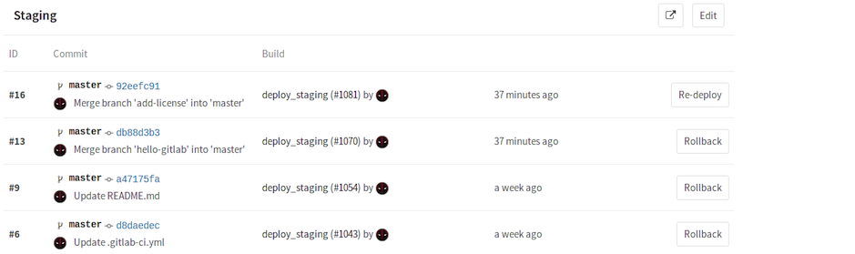

class: center, middle

# Gitlab CI 

#### How unu uses Gitlab Ci

 

.left[
David Rubin]
.left[
[<i class="fa fa-twitter" aria-hidden="true"> drubin87</i>](http://twitter.com/drubin87)]
.left[
[<i class="fa fa-github" aria-hidden="true"> drubin</i>](http://github.com/drubin)]
.left[
[<i class="fa fa-linkedin" aria-hidden="true"> David Rubin</i>](https://www.linkedin.com/in/davidrub)]
.left[
[<i class="fa fa-link" aria-hidden="true"> unu</i>](https://www.unumotors.com)]

---

# Features we use

* Environments
* Manual stages (approving releases)
* Runners on Mac for iOS builds
* Docker runner (side-by-side)
* Custom docker image for builders

 
---

# yaml anchor


Extenable yaml file .gitlab-ci.yml

```yaml
.generic-build: &build
    stage: build
    tags: 
        - 17.06.0-ce
    script:
        - ./build.sh $SERVICE_NAME

# user-service
build-user-service:
    <<: *build
    variables:
        SERVICE_NAME: "user-service"

# admin-service
build-admin-service:
    <<: *build
    variables:
        SERVICE_NAME: "admin-service"
```
---

# Docker-side-by-side-docker

* Not dind
* Leverage host machine's cache
* Speeds up builds between runs


```yaml
concurrent = 4
[[runners]]
  name = "docker-17.06.0-ce-2"
  ...
  [runners.docker]
    image = "docker:17.06"
    volumes = ["/cache", "/var/run/docker.sock:/var/run/docker.sock"]
  [runners.cache]
```
* Doesn't solve the distrubuted cache problem
---

## Distributed caching (multi machine)

2 hard problems in computer science 

1. Naming things
1. Cache invalidation 
1. Off by 1 errors 
----
--

Legacy way  

```
docker save <IMAGE> $(docker history -q <IMAGE>) > image.tar
docker load < image.tar
``` 

But this involves syncing .tar files

----

--

How we do it. *We use v17.03.0-ce for our builds*

```bash
# Always pull the latest service image
docker pull service-image:latest
```

--

```
# Explicitly tell docker to leverage the cache from the image registry
docker build --cache-from service-image:latest  -t service-image:$CI_BUILD_REF  .
```

---
## Change detection

* Multiple services in a single git repository
* We version and deploy these services seperately
* 'deployable changes' don't always result in production changes i.e readme
* Docker gives us this for free

--

Get the sha of the built image

```bash
SHA_HASH=$(docker images service-image:${CI_BUILD_REF}  --format="{{.ID}}")
```
--
```bash
LATEST_HASH=$(docker images service-image:latest  --format="{{.ID}}")
```

--
Now we can detect "compiled changes"
```
if [[ "$SHA_HASH" != "$LATEST_HASH" ]]; then
	docker tag service-image:${CI_BUILD_REF} service-image:latest
	docker push service-image:${CI_BUILD_REF}
	docker push service-image:latest
fi
```

---
# Links

** Presenation ** 
* Slides https://drubin.github.io/presentations/ 
* [yaml anchor](http://blog.daemonl.com/2016/02/yaml.html)
* [First docker export / import](http://codenow.github.io/blog/distributing-docker-cache-across-hosts)
* [Cache bug](https://github.com/moby/moby/issues/20316)
* [Fixed in v17.03.0-ce](https://github.com/moby/moby/pull/31189)

 --- 
.center[**Thanks**]
