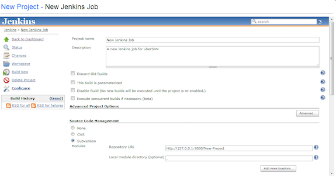
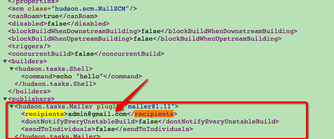
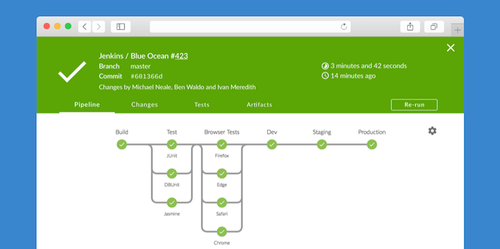
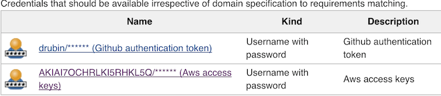
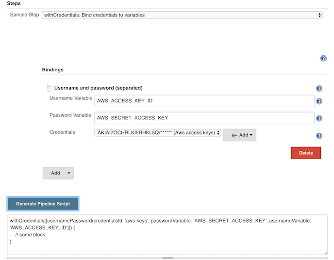

class: center, middle
# Jenkins Pipelines

#### Automating the Automation

 

.left[
David Rubin]
.left[
[<i class="fa fa-slack" aria-hidden="true"></i> zatech](http://zatech.co.za)]
.left[
[<i class="fa fa-twitter" aria-hidden="true"> drubin87</i>](http://twitter.com/drubin87)]
.left[
[<i class="fa fa-github" aria-hidden="true"> drubin</i>](http://github.com/drubin)]
.left[
[<i class="fa fa-linkedin" aria-hidden="true"> David Rubin</i>](https://www.linkedin.com/in/davidrub)]


---

### Jenkins 1.0





---

# Problems 

* Not versioned 
* Impossible to review 
* The automation was the problem
* Build jobs out of sync with code 
* Dependant jobs configured in different places
* Workflows never match "single job" design 
* Lots of plugins try to hack solutions

---

## Jenkinsfile 
```groovy 
def pullRequest = false

ansiColor('xterm') {
  node {
    // Set github status that the images could be built successfully
    step([$class: 'GitHubSetCommitStatusBuilder'])
    checkout scm
    stage('install'){
      downloadTerraform()
      env.PATH = "${env.PATH}:${env.WORKSPACE}"
    }

    stage('plan') {
      // Assumes you have setup a credential with ID aws-keys that contains your AWS acces tokens 
      // We automatically inject them as the standard AWS variables so terraform can read them
      withCredentials([usernamePassword(credentialsId: 'aws-keys', passwordVariable: 'AWS_SECRET_ACCESS_KEY', usernameVariable: 'AWS_ACCESS_KEY_ID')]) {
        sh 'terraform plan -out plan.plan'
      }
    }

    stage('show'){
      sh "terraform show   plan.plan"
      // Save plan output for future so they can be compared
      archiveArtifacts 'plan.plan'
      // store the plan file to be used later on potentially different node
      stash includes: 'plan.plan', name: 'plans'

      // we don't release or ask for user input on pull requests
      pullRequest = env.BRANCH_NAME != 'master'
    }
  }
}
```

---

## Meet Blue Ocean


---

# Credential Manager



---

# Script Generator
[http://localhost:8080/job/drubin/pipeline-syntax/](http://localhost:8080/job/drubin/pipeline-syntax/)


---

# Useful plugins 

* ec2 Slave plugin 
* 


--- 


# Links

* fabric8io libs https://github.com/fabric8io/jenkins-pipeline-library
* Locks and Milstones https://jenkins.io/blog/2016/10/16/stage-lock-milestone/
* Examples https://jenkins.io/doc/pipeline/examples/
* Reference https://jenkins.io/doc/pipeline/steps/