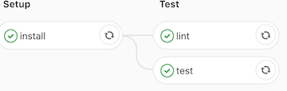
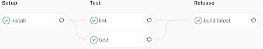
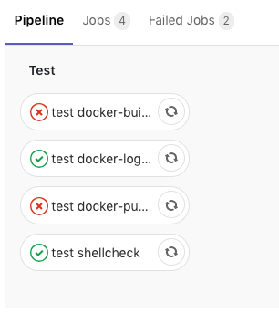

class: center, middle

# Gitlab CI

#### Engineering Experiences

 

.left[
David Rubin]
.left[
[<i class="fa fa-twitter" aria-hidden="true"> drubin87</i>](http://twitter.com/drubin87)]
.left[
[<i class="fa fa-github" aria-hidden="true"> drubin</i>](http://github.com/drubin)]
.left[
[<i class="fa fa-linkedin" aria-hidden="true"> David Rubin</i>](https://www.linkedin.com/in/drubin87)]
.left[
[<i class="fa fa-link" aria-hidden="true"> garden.io</i>](https://garden.io)]
.left[
[<i class="fa fa-link" aria-hidden="true"> drubin.github.io/presentations/</i>](https://drubin.github.io/presentations/)]

???
* Name, South African 
* SRE and Garden.io 
* I love development tooling
* Gitlab vs Jenkins vs Travis/Circle/hosted?
* Operator vs User
* Link to presneation

---
class: center, middle
### Human beings, who are almost unique in having the ability to learn from the experience of others, are also remarkable for their apparent disinclination to do so.
  \-  Douglas Adams, Last Chance to See

???
* Humans are special in that they can learn from eachother 
* Whats funny is they often don't want to

---
class: center, middle
# Gitlab's .gitlab-ci.yml

```sh
curl -s https://gitlab.com/gitlab-org/gitlab-ce/raw/master/.gitlab-ci.yml | wc -l
     958
```

## 958 lines
Duplicated yaml

Doesn't even include automatic releasing

---
class: center, middle

## CI lets us learn from our selves 
Why don't we learn from each other?

---
class: center, middle

## Abstractions

Levels and layers

---
class: center, middle

# Riding a bike

???

* When did you learn? 
* How would you teach me?
* Where would you start? 

---
class: center, middle
## Magical Moment


.footer[BrumBrumBikes [CC BY-SA 4.0 (https://creativecommons.org/licenses/by-sa/4.0)], from Wikimedia Commons]

---
class: center, middle
## Training Wheels


.footer[Dawn Endico from Menlo Park, California [CC BY-SA 2.0 (https://creativecommons.org/licenses/by-sa/2.0)], via Wikimedia Commons]

---
class: center, middle
## Professional


.footer[Calvert Lithographic Co., Detroit, Michigan [Public domain], via Wikimedia Commons]

---
class: center, middle
### It’s all about the journey, not the outcome.
  \-  Carl Lewis

---
class: middle
## Engineer The Journey
You *can* control the experience
1. **Magical Moment**
  * Homepage
  * High Level features and functions
  * Simple use cases that always work
2. **Training Wheels**
  * Quickstart designed to “just work”
  * Take the quickstart and own it
  * FAQ of potential failure’s
3. **Profesional**
  * Low level API docs 
  * Advanced features 
  * How to deal with exceptions
---
class: center, middle
### Treat Gitlab as a product/service not a tool.
---
## Why not Gitlab Auto Devops

1. **Magical Moment**
  * Check! Winning
--

2. **Training Wheels**
  * Okish... 
--

3. **Profesional**
  * Failed
  * Didn't exsist when I did this
  * Limited custom configuration
  * All or nothing approach
  * Not production ready
---
class: center, middle
## So what now?
Example Walk Through
---
### Simple Node Application

```
tree
.
├── Dockerfile
├── index.js
├── package-lock.json
└── package.json

0 directories, 4 files```

index.js
```js
const express = require('express')
const app = express()
app.get('/', (req, res) => res.send('Hello World!'))
app.listen(3000)
```

DockerFile
```docker
FROM node:10.13-alpine
WORKDIR /app
ADD package.json package-lock.json /app/
RUN npm install --production
ADD . /app
CMD ["node", "index.js"]
```
---
class: center, middle

\- Tests, Linting , Docker build, Docker release 

\- Company standards.....

\- Security complience 

\- Integration Tests

\- Read 1000 pages of outdated wiki docs

### 1000's of lines of yaml?

---
## Shared Company Workflows
.gitlab-ci.yml   (**8 lines of yaml**)
```yml
# Opt-in stages
stages:
  - setup
  - test
  - release

# Include workflows 
include:
 - https://gitlab.com/drubin/ci-base/raw/v0.1/includes/node.yml
 - https://gitlab.com/drubin/ci-base/raw/v0.1/includes/docker.yml
  
# node version to run tests
image: node:10.13-alpine
```
--

 

--


---
##  Node Workflow
```yaml
# Include workflows 
include:
 - https://gitlab.com/drubin/ci-base/raw/v0.1/includes/node.yml
 ```
--

```yaml
.node-test: 
  # snipped ...
  cache:
    paths:
      - node_modules
    
install:
  stage: setup
  script:
    - npm install 
  cache:
    paths:
      - node_modules

lint:
  extends: .node-test
  script:
    - npm lint
  
test:
  extends: .node-test
  script:
    - npm test
```
 
---

##  Docker Workflow
```yaml
# Include workflows 
include:
 - https://gitlab.com/drubin/ci-base/raw/v0.1/includes/docker.yml
 ```

--

```yaml
# Workflows 
build latest:
  stage: release
  extends: .use-docker
  script:
    - workflow-master
  only:
    - master

build tags:
  stage: release
  extends: .use-docker
  script:
    - workflow-tags
  only:
    - tags
```

---

## .center[CI Base]
### tree
```
├── .gitlab-ci.yml
├── Dockerfile
├── README.md
├── bin
│   ├── docker-build
│   ├── docker-help
│   ├── docker-login
│   ├── docker-push
│   ├── workflow-master
│   └── workflow-tags
└── includes
    ├── docker.yml
    └── node.yml
```

### docker-build

with distributed caching
```sh
#!/bin/sh
docker pull "$CI_REGISTRY_IMAGE:latest" || true
docker build --cache-from "$CI_REGISTRY_IMAGE:latest" --tag "$CI_REGISTRY_IMAGE:$CI_COMMIT_SHA" .
```
.footer[https://gitlab.com/drubin/ci-base/]
???
* This is so you can bundle shared scripts/tools 
* Predefined conventions
* "Just works"
---
## .center[ci-base/.gitlab-ci.yml]

```yaml
# Reuseable variables
.test-script: 
  # .... snipped
  stage: test
  extends: .use-docker
  before_script:
    - TEST_SCRIPT="${CI_JOB_NAME##* }" # script last part of job name
    - ./bin/$TEST_SCRIPT
```
--
```yaml
# Unit Tests
test docker-build:
  extends: .test-script
  script:
    # (assert) verify image is built 
    - docker inspect "$CI_REGISTRY_IMAGE:$CI_COMMIT_SHA"
```
--
```yaml
# Integration Tests
build latest:
  stage: release
  extends: .use-docker
  script:
    # manually add scripts to path since we aren't using pre-built images
    - workflow-master
  only:
    - master
```
.footer[https://gitlab.com/drubin/ci-base/blob/master/.gitlab-ci.yml]

---
## Changeset for bin/docker-build
```diff
docker pull "$CI_REGISTRY_IMAGE:latest" || true
- docker build --cache-from "$CI_REGISTRY_IMAGE:latest" --tag "$CI_REGISTRY_IMAGE:$CI_COMMIT_SHA" .
+ docker build --cache-from "$CI_REGISTRY_IMAGE:latest" --tag "$CI_REGISTRY_IMAGE:broken" .
```
--
Pipeline Status


---
class: middle, center

# Inception

--

Using gitlab-ci to test your gitlab-ci?
 
--

Automated testing for your testing tools?

--

Can some one say recursion?
---
class: middle
## Simple Node application

```
tree
.
├── .gitlab-ci.yml
....

0 directories, 5 files
```

.gitlab-ci.yml

```yaml
# Opt-in stages
stages:
  - setup
  - test
  - release

# Include workflows 
include:
 - https://gitlab.com/drubin/ci-base/raw/v0.1/includes/node.yml
 - https://gitlab.com/drubin/ci-base/raw/v0.1/includes/docker.yml
  
# node version to run tests
image: node:10.13-alpine
```
 
---
class: center, middle
## Human beings, who are almost unique in having the ability to learn from the experience of others, are also remarkable for their apparent disinclination to do so.
  \-  Douglas Adams, Last Chance to See
---
class: center, middle

## Standing on the shoulders of giants
---

# Links

** Presenation ** 
* Slides https://drubin.github.io/presentations/ 
* [yaml anchor](http://blog.daemonl.com/2016/02/yaml.html)
* [Gitlab's Yaml](https://docs.gitlab.com/ce/ci/yaml/)
* [ci-base](https://gitlab.com/drubin/ci-base/)
* [Node Demo](https://gitlab.com/drubin/ci-node-demo)
* [breaking PR change](https://gitlab.com/drubin/ci-base/merge_requests/2/diffs)


.center[**Thanks**]


David Rubin  
[<i class="fa fa-twitter" aria-hidden="true"> drubin87</i>](http://twitter.com/drubin87)  
[<i class="fa fa-github" aria-hidden="true"> drubin</i>](http://github.com/drubin)  
[<i class="fa fa-linkedin" aria-hidden="true"> David Rubin</i>](https://www.linkedin.com/in/drubin87)  
[<i class="fa fa-link" aria-hidden="true"> garden.io</i>](https://garden.io) 

  --- 

